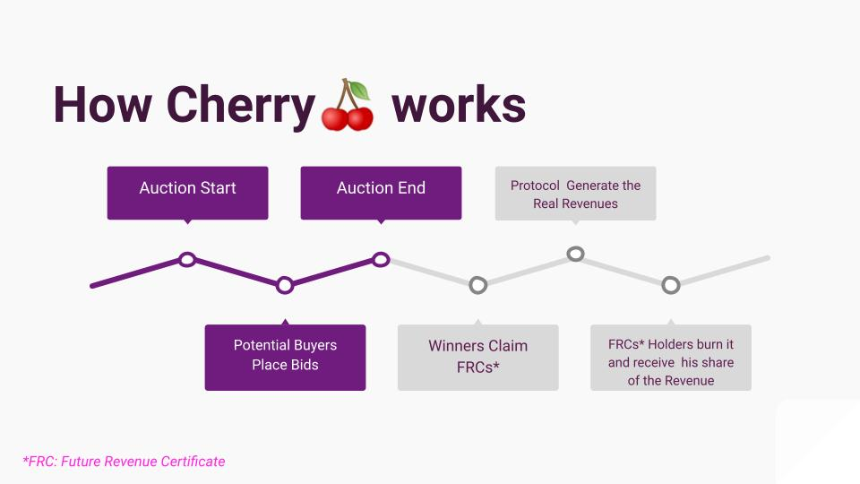

### Smart Contract Repo
https://github.com/tomasCalletce/5dmayo-contracts

# Cherry🍒
With Cherry🍒 sell your future income and obtain the capital you need to grow your business without suffering the friction and bias of traditional financing.

## The Problem
- **Difficulties in Traditional Financing:** "Startups struggle to overcome obstacles in conventional financing, with slow processes and onerous requirements."
- **Limited Access to Financial Resources:** "Emerging businesses often face barriers to accessing financing, limiting their ability to grow and prosper."
- **Transparency Challenge:** "The lack of transparency in traditional financial processes creates uncertainty for startups and investors."

## The Solution: Cherry 🍒
- **Cherry as a Financial Bridge:** "Cherry acts as a bridge, allowing startups to overcome financial limitations by selling future revenue in innovative ways."
- **Blockchain as a Decentralized Solution:** "Cherry uses blockchain technology to create decentralized auctions, offering transparency and trust in the sale of future income."

## The Technology: Auctions + Blockchain
- **Revenue History:** Protocols revenues history can be their opportunity to grow.
- **Auctions Contract:** Buyers place their bids, and compete for an allocation of the future revenues.
- **Split Fees Contract:** User claim their fees participation.

## How Cherry🍒 Works

# Cherrynizate🍒
